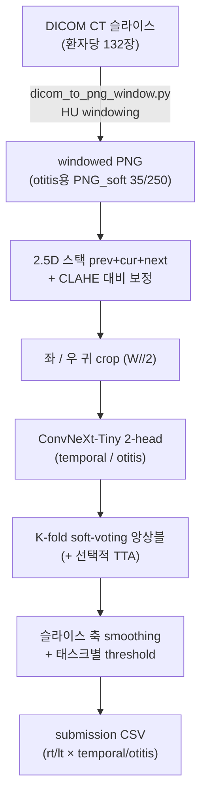
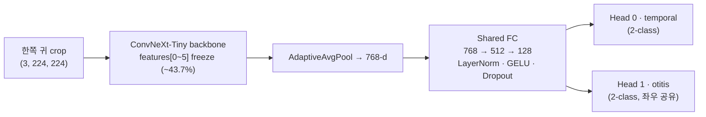

# 측두골 CT 중이염 분류 — ConvNeXt-Tiny 2-Head (TBCT)

측두골 CT(Temporal Bone CT, TBCT) 영상에서 **측두골 이상(temporal)** 과 **중이염(otitis media)** 을 좌·우 귀별로 분류하는 의료 영상 딥러닝 프로젝트입니다. 한 환자의 132장 CT 슬라이스를 입력받아 4개 출력(`rt_temporal`, `lt_temporal`, `rt_otitis`, `lt_otitis`)을 슬라이스 단위로 예측합니다.

`Python` · `PyTorch / torchvision` · `ConvNeXt-Tiny` · `OpenCV` · `pydicom`

---

## 프로젝트 개요

측두골 CT는 한 번의 촬영으로 양쪽 귀가 함께 담깁니다. 이 프로젝트는 두 가지 소견을 각 귀에 대해 판별합니다.

- **temporal** — 측두골(뼈) 영역의 이상
- **otitis** — 중이염(중이 내 염증·액체)

좌우 귀 × 두 소견 = 4개 태스크를 출력하며, 환자당 132장 슬라이스 각각에 대해 0/1을 채운 `submission` CSV를 생성합니다. 의료 영상 특성상 다음을 핵심 과제로 다뤘습니다.

- **CT window 선택** — 뼈(temporal)와 연부조직·액체(otitis)는 최적의 HU window가 다릅니다.
- **좌·우 방향 정합** — crop된 좌/우가 환자 기준 Rt/Lt와 어긋나면 점수가 무너지므로, 학습·추론의 방향 규약을 엄격히 일치시켜야 합니다.
- **슬라이스 간 일관성** — 인접 슬라이스는 비슷한 소견을 가지므로, 예측을 슬라이스 축으로 평활해 노이즈를 줄입니다.

---

## 최종 접근

여러 실험(아래 [실험 변형](#실험-변형) 참고) 끝에 채택한 최종 파이프라인은 **한쪽 귀 crop + 2-head ConvNeXt-Tiny** 구성입니다.



**2-head 설계의 핵심.** 좌/우 crop이 **otitis head를 공유**합니다. 3-head 방식(otitis를 rt/lt로 분리)과 달리, 공유 head는 좌우 양쪽 데이터를 모두 학습하므로 데이터 효율이 높습니다. temporal head도 동일하게 좌우 crop이 공유합니다.

---

## 모델 아키텍처



- **Backbone:** ConvNeXt-Tiny (ImageNet pretrained). 출력 768채널을 GAP로 집약.
- **Early layer freezing:** stem~stage3(`features[0]`~`features[5]`, 약 43.7%)를 동결해 저수준 표현은 유지하고 상위층만 미세조정.
- **Shared layer:** `768 → 512 → 128` (LayerNorm + GELU + Dropout 0.5/0.3/0.3). 태스크 간 공통 표현을 학습.
- **Heads:** temporal·otitis 각각 독립 `Linear(128 → 2)`.
- **출력:** `(B, 2, 2)` = (배치, 2 task, 2 class). 한쪽 귀 crop을 받아 temporal/otitis 확률을 동시에 반환.

---

## 핵심 기법

- **HU windowing 전처리** — DICOM의 HU값에서 bone window(700/4000, temporal)와 soft-tissue window(35/250, otitis)를 직접 적용해 소견별로 최적화된 PNG를 생성. 기존 PNG는 보존.
- **2.5D 입력** — 인접 슬라이스(prev/cur/next)를 RGB 3채널로 쌓아, 2D CNN에 단면 위아래의 볼륨 맥락을 제공.
- **CLAHE** — 국소 대비 향상으로 미세 구조 가시성 개선.
- **좌·우 귀 crop + 공유 head** — 슬라이스를 `W//2` 기준으로 좌/우 분할, otitis·temporal head를 좌우가 공유해 학습 데이터를 두 배로 활용.
- **K-fold soft-voting 앙상블** — `best_..._fold*.pth`를 자동 감지해 확률 평균.
- **슬라이스 축 smoothing** — 인접 슬라이스 예측을 이동평균(window=3)해 산발적 오탐을 억제.
- **TTA (선택)** — 회전 ±5°·줌 1.06배. **좌우/상하 flip은 사용하지 않음**(R/L 진단 의미 보존).
- **태스크별 threshold** — 4개 출력에 독립적인 결정 임계값을 적용.
- **학습·추론 정합 안전장치** — `CROP_SIDE_TO_RL`(좌우 방향 규약), `W//2` crop 기준, letterbox 방식을 학습/추론 양쪽에서 강제로 일치시키고, stats JSON에 저장된 방향값과 추론 설정이 다르면 경고를 출력.

---

## 저장소 구조

### 최종 파이프라인 파일

| 파일 | 역할 |
|------|------|
| `dicom_to_png_window.py` | DICOM → window PNG 전처리 (bone / soft-tissue) |
| `model_convNeXt-Tiny_crop_2head.py` | 2-head ConvNeXt-Tiny 모델 정의 |
| `train_crop_2head.py` | K-fold 학습 → `best_..._fold{k}.pth`, `preproc_..._stats.json` 생성 |
| `inference_crop_2head.py` | PNG_soft 기반 추론 → `submission_validation.csv` |
| `inference_crop_2head_pngonly.py` | PNG_soft 우선, 없으면 **DICOM에서 직접** 추론(robust 슬라이스 매핑) |

### 보조 스크립트

`sweep_thresholds_2head.py`(태스크별 threshold 탐색), `evaluation.py` · `evaluation_per_task.py`(검증 채점) 등이 함께 포함됩니다.

### 실험 변형

본 저장소에는 개발 과정에서 탐색한 다양한 변형이 함께 들어 있습니다. 최종 채택은 **2-head crop**이며, 나머지는 비교 실험용입니다.

- **head 구성:** `2head`(otitis 좌우 공유) vs `3head`(otitis rt/lt 분리), `3head_3win`(다중 window)
- **학습 기법:** `ema`(가중치 EMA), `flip`(flip 증강), `sideloss`(보조 손실), `sampler`(클래스 균형 샘플링)

> 데이터(`data/`), 모델 가중치(`*.pth`), 생성된 제출 파일은 용량·개인정보 문제로 저장소에 포함하지 않습니다. 아래 절차로 재생성하세요.

---

## 데이터 구성

```
data/
├── {pid}/
│   ├── DCM/0001.dcm ...           # 원본 DICOM (132 슬라이스)
│   └── PNG_soft/0001.png ...      # 전처리 출력 (dicom_to_png_window.py)
└── val/{pid}/ 또는 train/{pid}/   # split 구조도 자동 탐색
submission_template.csv            # No · R/L · Image number · 슬라이스 1~132 컬럼
```

---

## 설치 및 실행

### requirements.txt

```
torch
torchvision
numpy
pandas
opencv-python
pydicom
tqdm
```

```bash
pip install -r requirements.txt
```

### 1. 전처리 — DICOM → window PNG

```bash
# otitis용 soft-tissue window (35/250) → PNG_soft
python3 dicom_to_png_window.py --soft

# (선택) 측두골용 bone window (700/4000) → PNG_bone
python3 dicom_to_png_window.py
```

### 2. 학습 — K-fold

```bash
python3 train_crop_2head.py
# → best_model_convNeXt-Tiny_crop_2head_fold0.pth, fold1.pth, ...
# → preproc_model_convNeXt-Tiny_crop_2head_stats.json
```

### 3. 추론 — 앙상블 + 제출 파일 생성

```bash
# fold 가중치 중 아무거나 하나를 인자로 전달하면, 같은 이름의 fold*.pth를
# 모두 자동 감지해 soft-voting 앙상블로 추론합니다.
python3 inference_crop_2head.py best_model_convNeXt-Tiny_crop_2head_fold0.pth

# PNG_soft가 없고 DICOM에서 바로 추론하려면:
python3 inference_crop_2head_pngonly.py best_model_convNeXt-Tiny_crop_2head_fold0.pth
# → submission_validation.csv
```

---

## 재현 시 주의사항

- **`CROP_SIDE_TO_RL` 일치 (가장 중요).** 학습(`train_crop_2head.py`)과 추론 스크립트의 이 값이 다르면 좌/우가 뒤바뀌어 점수가 붕괴합니다. stats JSON에 저장된 값과 추론 설정이 다르면 경고가 출력되니 반드시 맞추세요.
- **`W//2` crop 기준과 letterbox 코드 동일 유지.** 학습/추론 전처리 분포가 어긋나면 성능이 무너집니다. 한쪽만 수정하지 마세요.
- **window 일관성.** `PNG_soft`(otitis)는 학습·추론이 같은 soft window(35/250)로 생성/해석되어야 합니다. window를 바꾸면 mean/std(stats)도 새로 계산해야 합니다.
- **flip 금지.** 좌우/상하 반전은 R/L 진단 의미를 훼손하므로 증강·TTA에서 제외합니다.
